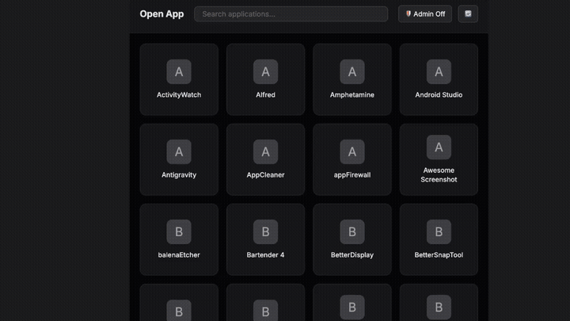

  
  
  <h1 align="center">OPEN APPLICATION</h1>
  <h3 align="center"> macOS App Launcher Embedded in Obsidian </h3>

  <!-- TOP PURPLE LINKS -->
  
  
  
   
  <!-- BOTTOM GOLD TAXONOMY -->
  
  
  
  

  

  

    <i> A macOS application launcher embedded inside Obsidian — browse, search, and launch any installed app without leaving your workspace. </i>
  

  

Welcome to **Open Application**, a lightweight Obsidian utility component powered by Datacore. It reads your `/Applications` directory using Node.js, renders every installed `.app` as a clickable card in a responsive grid, and launches them via the native macOS `open` command — all without leaving Obsidian.

---

## Features

### Instant App Launcher
*   **Full App Grid**: Automatically scans `/Applications` and renders every `.app` bundle as a card with the app's initial letter as a fallback icon.
*   **Live Search**: Type to instantly filter the grid — results update on each keystroke with no debounce delay.
*   **One-Click Launch**: Click any card to launch the app via `open -a`. A per-card spinner shows while launching.

### Admin Mode
*   **Elevated Launch**: Toggle admin mode to launch apps with administrator privileges using `osascript` — macOS prompts for your system password graphically.
*   **Visual Indicator**: Admin toggle turns red with a shield icon when active, so you always know when elevated mode is on.

### Theme Adaptive
*   **Host-Native Theme Adaptability**: All UI elements use Obsidian CSS variables — automatically matches any theme in both dark and light modes.
*   **Offline**: No network requests, no CDN dependencies. Pure Node.js + React.

---

## Directory Index & Components

| File | Description |
| :--- | :--- |
| **[`OPEN APPLICATION.md`](OPEN%20APPLICATION.md)** | The main entry point leaf designed to be loaded inside Obsidian panes. |
| **[`src/index.jsx`](src/index.jsx)** | Main bootstrap application loader and polling invalidation daemon. |
| **[`src/App.jsx`](src/App.jsx)** | The view coordinator loading dependency modules. |
| **[`src/components/AppLauncher.jsx`](src/components/AppLauncher.jsx)** | The core launcher UI with search, admin toggle, and app grid. |
| **[`src/components/AppCard.jsx`](src/components/AppCard.jsx)** | Individual app card tile with hover state and loading overlay. |
| **[`src/styles/styles.jsx`](src/styles/styles.jsx)** | Helper styling sheet mapped to Obsidian native CSS variables. |
| **[`data/mcp_commands.json`](data/mcp_commands.json)** | Local polling payload for HMR invalidation. |
| **[`METADATA.md`](METADATA.md)** | Packaging manifest outlining indexing, target, and security configurations. |
| **[`CONTRIBUTION.md`](CONTRIBUTION.md)** | Contributor architecture standards. |
| **[`LICENSE.md`](LICENSE.md)** | MIT open-source license. |
